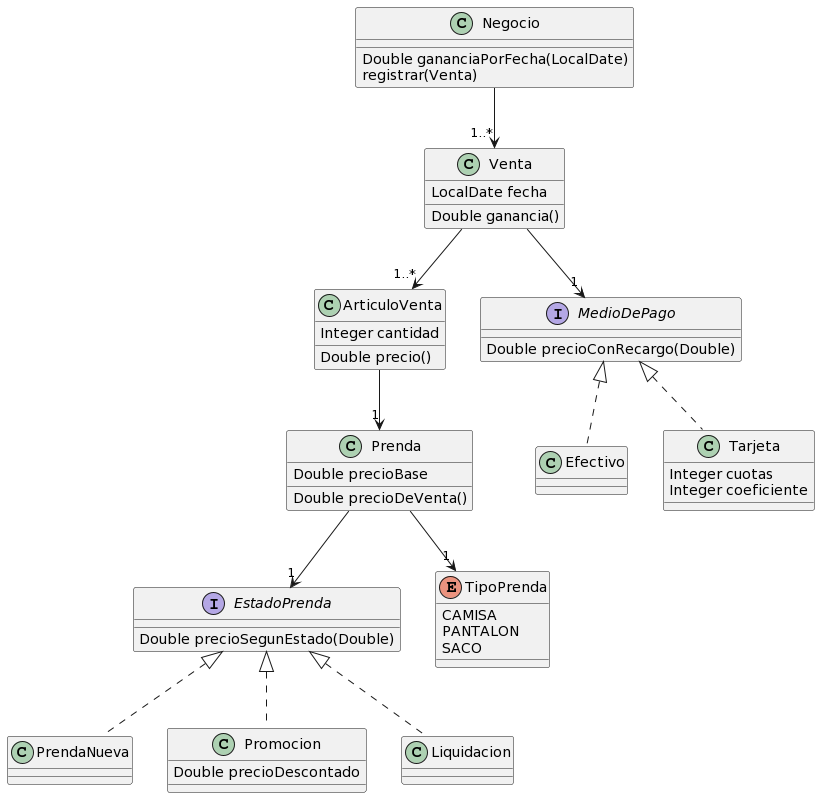

# Macowins

## 1. Requerimientos

- Determinar precio de venta de prendas y saber su tipo
- Registrar ventas y determinar ganancias de un determinado día

## 2. Solucion

	
## Comentarios

El cliente solicitó determinar las ganancias de un determinado día.
Para determinar la ganancia se deben modelar a las prendas de manera
que se pueda tener en cuesta el costo involucrado. Por el momento
Consideramos ganancia = dinero recaudado en ventas.

## 3. Comentarios de alternativas descartadas

- La clase prenda podria haberse implementado como abstracta, y cada subtipo ser una subclase

- Liquidacion podría ser subclase de Promoción lógicamente
pero es un caso tan simple que no hay diferencia real
entre una implementación y otra.
